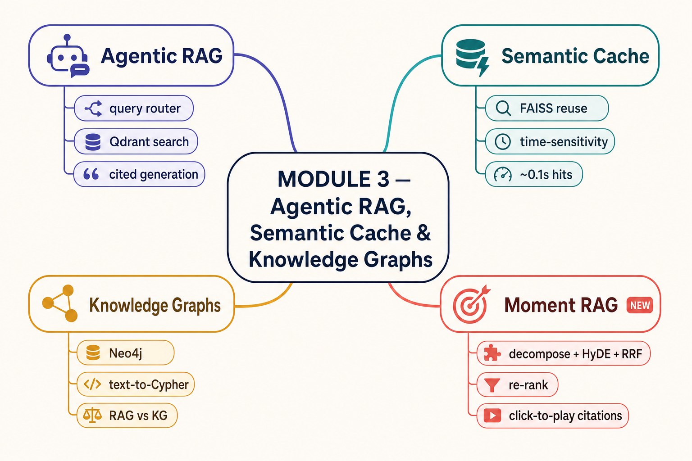

# Module 3: Agentic RAG

This module teaches you how to build intelligent Retrieval-Augmented Generation (RAG) systems that **reason before they retrieve**. Rather than routing every query through a single static pipeline, you'll learn how to give your RAG system *agency* — the ability to choose the right knowledge source, optimize for speed with semantic caching, and handle time-sensitive queries with live web search.

By the end of this module you will have built a full agentic RAG pipeline from scratch, without relying on any external agentic framework.

## Module 3 at a glance



Four moves toward **hybrid memory**: make retrieval **think** (Agentic RAG), make it **fast**
(Semantic Cache), make it **structured** (Knowledge Graphs), and make it **land on the exact
moment** (Moment RAG). Each is one folder below.

<details><summary>Text version</summary>

```text
MODULE 3 — Agentic RAG, Semantic Cache & Knowledge Graphs
│
├─ ① Agentic RAG        router (LLM) → Qdrant search → cited generation
├─ ② Semantic Cache     FAISS answer reuse · time-sensitivity guard · ~0.1s hits
├─ ③ Knowledge Graphs   Neo4j + text-to-Cypher · RAG vs KG · LLM judge
└─ ④ Moment RAG ✦ NEW   decompose + HyDE + RRF · cross-encoder re-rank · click-to-play citations
```
</details>

> **✦ Latest addition — [`Moment_RAG/`](Moment_RAG/):** agentic RAG on *video*. Ask a complex question and get a streamed, cited answer where each citation pops up the source YouTube episode at the **exact moment**, with a synced transcript. It's decompose → hybrid retrieve (dense + BM25 + HyDE questions, RRF) → cross-encoder re-rank → cited synthesis. See the [Moment RAG README](Moment_RAG/README.md).

---

## What You'll Learn

- How to use an LLM as a **query router** to dynamically pick the right retrieval backend
- How to build and populate a **vector database** (Qdrant) from raw PDF documents
- How **semantic caching** works and why it dramatically reduces latency and cost
- How to detect and handle **time-sensitive queries** that must never be served from cache
- How to combine document retrieval, vector search, and live web search into one coherent pipeline

---

## Module Structure

```
Module_3_Agentic_RAG/
│
├── Agentic_RAG/
│   ├── Agentic_RAG_Notebook.ipynb            # Core agentic RAG — routing + retrieval + generation
│   ├── Upload_data_to_Qdrant_Notebook.ipynb  # Data pipeline — PDF → embeddings → Qdrant
│   └── qdrant_data/                          # Pre-built vector collections (cloned from repo)
│       └── collection/
│           ├── opnai_data/                   # OpenAI Agents documentation embeddings
│           └── 10k_data/                     # Uber & Lyft SEC 10-K financial filing embeddings
│
├── Semantic_Cache/
│   └── Semantic_cache_from_scratch.ipynb     # Build a semantic cache from the ground up
│
├── rag_helpers.py                            # Shared helpers — all pipeline logic for notebook 4
├── Agentic_RAG_with_Semantic_Cache.ipynb     # Combined: agentic RAG + semantic cache (minimal notebook)
│
└── .env                                      # API keys (OpenAI, SerpApi, Traversaal Pro)
```

---

## Notebooks

### 1. Upload Data to Qdrant
**`Agentic_RAG/Upload_data_to_Qdrant_Notebook.ipynb`**

Before you can retrieve anything you need to build your vector store. This notebook walks through the full document ingestion pipeline:

- Extract text from PDFs using **PyMuPDF**
- Chunk documents using `RecursiveCharacterTextSplitter` (2 048-char chunks, 50-char overlap)
- Generate **768-dimensional embeddings** using `nomic-ai/nomic-embed-text-v1.5`
- Upload vectors with metadata to two **Qdrant** collections:
  - `opnai_data` — OpenAI Agents official documentation
  - `10k_data` — Uber 2021 and Lyft 2020–2024 SEC 10-K filings

> The pre-built `qdrant_data/` directory is already included in the repo so you can skip this step and jump straight into querying. Run this notebook only if you want to rebuild the index or add your own documents.

---

### 2. Agentic RAG
**`Agentic_RAG/Agentic_RAG_Notebook.ipynb`**

The core of this module. This notebook introduces **agentic decision-making** as the first step in a RAG pipeline — the system thinks before it retrieves.

#### How it works

```
                        User Query
                            │
                            ▼
              ┌─────────────────────────┐
              │   Router LLM (GPT-4o)   │
              │      route_query()      │
              └────────────┬────────────┘
                           │
         ┌─────────────────┼──────────────────┐
         ▼                 ▼                  ▼
  OPENAI_QUERY     10K_DOCUMENT_QUERY    INTERNET_QUERY
         │                 │                  │
         ▼                 ▼                  ▼
  Qdrant search     Qdrant search        SerpApi
  (opnai_data)      (10k_data)          (live web)
         │                 │                  │
         └────────┬─────────┘                  │
                  ▼                            │
         RAG Response Generator                │
         rag_formatted_response()              │
                  │                            │
                  └──────────────┬─────────────┘
                                 ▼
                          Final Response
```

#### Key components

| Function | Role |
|---|---|
| `route_query()` | Calls GPT-4o with a router prompt; returns `action`, `reason`, and a short `answer` as JSON |
| `get_text_embeddings()` | Converts a query string to a 768-dim Nomic vector |
| `retrieve_and_response()` | Async function — queries Qdrant (top-3 chunks) then calls the RAG generator |
| `rag_formatted_response()` | Passes retrieved context to GPT-4 and asks it to answer with inline citations |
| `get_internet_content()` | Calls the SerpApi Google Search API for real-time answers |
| `agentic_rag()` | Main orchestrator — ties routing, retrieval, and generation together |

#### Data sources
- **OpenAI documentation** — Agents, tools, chat completions, best practices
- **10-K SEC filings** — Uber 2021 and Lyft 2020–2024 financial data
- **Live internet** — Any query outside the above two domains via SerpApi

#### Assignment
Implement **sub-query division** — split compound questions (e.g. *"What was Uber's and Lyft's revenue in 2021?"*) into individual sub-queries and process each one through the agentic pipeline independently.

---

### 3. Semantic Cache from Scratch
**`Semantic_Cache/Semantic_cache_from_scratch.ipynb`**

Builds a semantic cache without using any high-level caching library. The goal is to understand exactly how vector-based answer reuse works under the hood.

#### How it works

```
                        User Query
                            │
                            ▼
              ┌─────────────────────────────┐
              │    Time-Sensitivity Check    │
              │     is_time_sensitive()      │
              │  "now", "today", "outage"…   │
              └────────────┬────────────────┘
                           │
              YES ──────────┘──────────── NO
               │                          │
               ▼                          ▼
           SerpApi                  Embed Query
        (live search)          nomic-embed-text-v1.5
         NOT cached                      │
                                         ▼
                               ┌──────────────────┐
                               │   FAISS Search   │
                               │ IndexFlatL2      │
                               │ threshold = 0.2  │
                               └────────┬─────────┘
                                        │
                          HIT ──────────┴────────── MISS
                           │                          │
                           ▼                          ▼
                   Return cached           Traversaal Pro RAG
                   answer  ⚡              (AWS Guidebook)
                   ~0.1–0.2 s             Store → Return
                                          ~6–8 s
```

#### What gets cached

```
cache.json
{
  "questions"    : ["What is S3?", …],
  "embeddings"   : [[0.12, -0.43, …], …],   ← 768-dim Nomic vectors
  "answers"      : [{ full API response }, …],
  "response_text": ["An S3 bucket is …", …]
}
```

The FAISS `IndexFlatL2` is rebuilt in-memory from the JSON file on every load, so the cache survives notebook restarts.

#### Routing decision at a glance

| Query type | Backend | Cached? | Typical latency |
|---|---|---|---|
| Temporal keyword detected | SerpApi (live Google) | No | 0.1–1.5 s |
| Stable — FAISS hit (dist ≤ 0.2) | JSON store | Already stored | 0.1–0.2 s |
| Stable — FAISS miss (dist > 0.2) | Traversaal Pro RAG | Stored after call | 6–8 s |

#### External APIs used
- **Traversaal Pro** — hosted RAG over the AWS Guidebook corpus (`POST https://pro-documents.traversaal-api.com/documents/search`)
- **SerpApi** — real-time Google search results (`GET https://serpapi.com/search.json`)

---

### 4. Agentic RAG with Semantic Cache
**`Agentic_RAG_with_Semantic_Cache.ipynb`** + **`rag_helpers.py`**

This notebook combines everything — it wraps the full three-way agentic RAG pipeline from Notebook 2 inside the semantic cache layer from Notebook 3. The result is a system that is both *intelligent* (routes queries to the right source) and *efficient* (avoids redundant calls for similar questions).

All implementation lives in `rag_helpers.py` so the notebook stays minimal and focused on demonstrating system behaviour. After a `git clone` and a single `init_rag()` call, the entire pipeline is available via one function: `agentic_rag_with_cache(query, cache)`.

#### `rag_helpers.py` — what's inside

| Symbol | Type | Purpose |
|---|---|---|
| `init_rag(openai_api_key, serp_api_key, qdrant_path)` | function | One-time setup — loads Nomic model, wires OpenAI client, Qdrant, and SerpApi |
| `SemanticCaching` | class | FAISS-backed cache with time-sensitivity filter, JSON persistence, `check_cache()` / `add_to_cache()` |
| `get_internet_content(query)` | function | Live Google search via SerpApi |
| `route_query(query)` | function | GPT-4o router returning `OPENAI_QUERY`, `10K_DOCUMENT_QUERY`, or `INTERNET_QUERY` |
| `agentic_rag_with_cache(query, cache)` | function | **Public entry point** — cache check → route → retrieve → store → return |

#### Full combined pipeline

```
User Query
    │
    ├─ Time-sensitive? ──YES──▶ SerpApi  (not cached)
    │
    └─ NO ──▶ FAISS cache lookup
                  │
                  ├─ HIT  ──▶ return stored answer  ⚡  (~0.1–0.2 s)
                  │
                  └─ MISS ──▶ Agentic RAG router
                                  │
                                  ├─ OPENAI_QUERY       ──▶ Qdrant (opnai_data) ──▶ GPT-4o RAG
                                  ├─ 10K_DOCUMENT_QUERY ──▶ Qdrant (10k_data)   ──▶ GPT-4o RAG
                                  └─ INTERNET_QUERY     ──▶ SerpApi (live web)
                                  │
                                  └─ Store result in cache ──▶ Return response
```

#### Minimal notebook structure

| # | Section | What it does |
|---|---|---|
| 1 | Setup | `pip install` + `git clone` + `from rag_helpers import ...` |
| 2 | API Keys | Load keys + `init_rag(...)` |
| 3 | Create Cache | `cache = SemanticCaching(clear_on_init=True)` |
| 4 | Pipeline reference | Markdown table pointing to `rag_helpers.py` |
| 5 | Demo | 7 test cells, each a single `agentic_rag_with_cache(query, cache)` call |
| 6 | Inspect | Cache state printout |

---

## Key Concepts Covered

| Concept | Description |
|---|---|
| **Agentic RAG** | An LLM reasons about *where* to search before it searches |
| **Query routing** | GPT-4o classifies queries into routing categories via a structured JSON prompt |
| **Vector embeddings** | Text is converted to 768-dim dense vectors using Nomic's embedding model |
| **Vector database (Qdrant)** | Embeddings are stored and searched by cosine/L2 similarity |
| **Semantic caching** | Previously seen (or semantically similar) queries are answered from cache instead of hitting the API again |
| **Time-sensitivity detection** | Keyword-based filter routes live queries to a web search API, bypassing the cache entirely |
| **RAG with citations** | Retrieved chunks are passed to an LLM which generates grounded answers with `[1][2]`-style references |

---

## Tech Stack

| Category | Library / Tool |
|---|---|
| LLM & Embeddings | `openai` (GPT-4o / GPT-4), `transformers`, `sentence_transformers`, `nomic-ai/nomic-embed-text-v1.5` |
| Vector database | `qdrant_client` (AsyncQdrantClient) |
| Similarity search / cache | `faiss-cpu` (IndexFlatL2) |
| Document processing | `fitz` (PyMuPDF), `langchain_text_splitters` |
| Async support | `asyncio`, `nest_asyncio` |
| Web / live search | `requests`, SerpApi (Google Search API), Traversaal Pro |
| Persistence | `json`, `python-dotenv` |
| Numerics | `numpy`, `torch` |

---

## Setup

### API keys required

| Key | Used in |
|---|---|
| `OPENAI_API_KEY` | Query routing and RAG generation (all notebooks) |
| `SERP_API_KEY` | Live Google search (Agentic RAG, combined, and Semantic Cache notebooks) |
| `traversaal_pro_api_key` | Hosted RAG over AWS Guidebook (Semantic Cache notebook only) |

**On Google Colab** — add keys to the Secrets panel (lock icon in the left sidebar).

**Locally** — create a `.env` file in `Module_3_Agentic_RAG/`:
```
OPENAI_API_KEY=sk-...
SERP_API_KEY=...
traversaal_pro_api_key=...
```

### Install dependencies

```bash
pip install openai qdrant-client transformers sentence-transformers \
            faiss-cpu torch numpy requests python-dotenv \
            langchain-text-splitters pymupdf einops nest_asyncio
```

### Recommended notebook order

1. `Agentic_RAG/Agentic_RAG_Notebook.ipynb` — start here to understand the routing architecture
2. `Agentic_RAG/Upload_data_to_Qdrant_Notebook.ipynb` — optional, only if you want to rebuild the vector index
3. `Semantic_Cache/Semantic_cache_from_scratch.ipynb` — understand caching mechanics in isolation
4. `Agentic_RAG_with_Semantic_Cache.ipynb` — the complete combined system

---

## Citation

If you use this code, please cite:

```
@misc{2024,
  title   = {Agentic RAG and Semantic Cache from Scratch},
  author  = {Hamza Farooq, Darshil Modi, Kanwal Mehreen, Nazila Shafiei},
  year    = {2024},
  license = {Apache 2.0}
}
```
